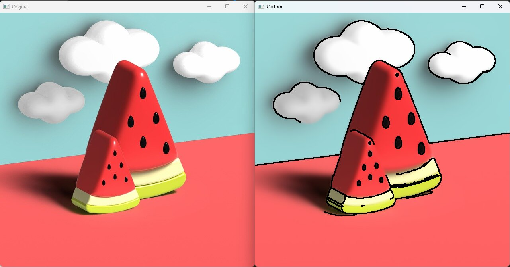
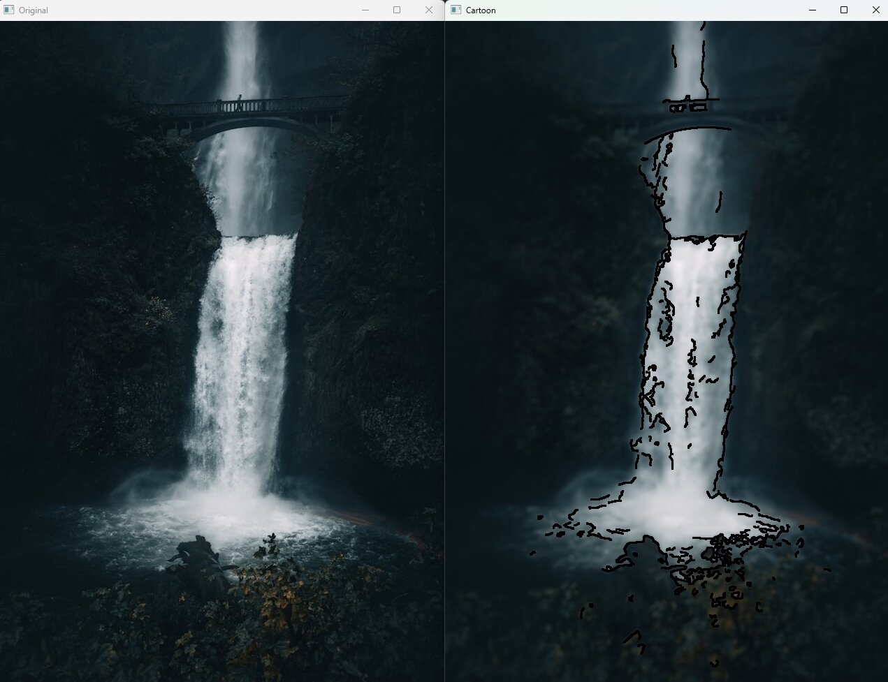

### Cartoon Image Rendering using OpenCv

이 프로그램은 원본 이미지를 OpenCv를 이용해서 만화스타일의 이미지로 변환합니다.

작동원리
이미지를 그레이스케일로 변환
 -> median blur를 통해 노이즈 제거
 -> Canny edge detector로 윤곽선(Edges) 검출
 -> dilation으로 윤곽선 두껍게
 -> bilateral filter를 사용하여 색상 단순화
 -> 윤곽선(Edges)을 색상 이미지위에 덮어씌워서 만화스타일 이미지 생성

### Successful Case

### Poorly Processed Result

### 한계점
-Canny edge dector로 윤곽선을 찾아내는 과정에서 한계가 느껴졌다. 
-이미지를 지역적으로 봤을때 Gradient값이 적은 부분의 윤곽선을 추출하는데 있어서 웬만한 변화가 있지않으면 edge를 검출하지 못하는 문제가 있다.
-그런 부분까지 검출하기위해 Canny edge dector의 threshold값들을 조정하면 노이즈까지 edge로 인식되는 문제가 있다. 
-이를 해결하기 위해서 sharpness를 증가시켜 경계의 그레디언트값을 크게 가져보려고 했으나 sharpness가 충분히 커지면 이미지의 손실이 너무 크게 발생해 적용하지 않았다.

